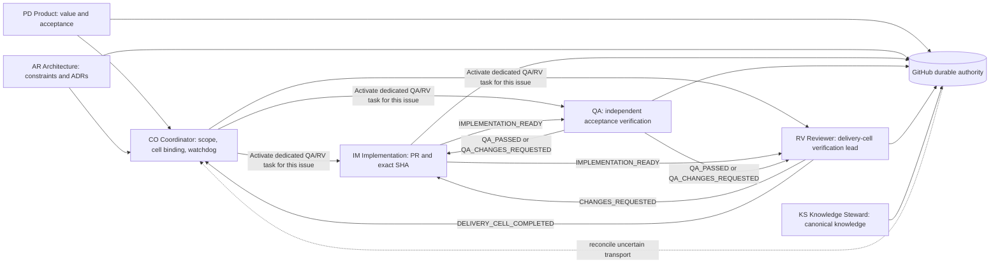
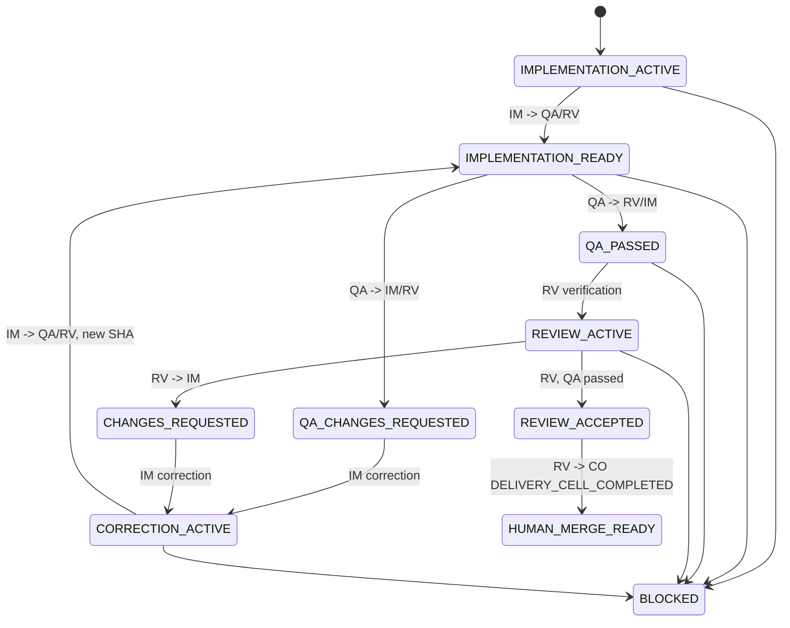

<!-- pleiad:managed coordination/v1 -->
# Coordination and delivery resilience

## Durable authority and delivery cell

GitHub issues, pull requests, commits, checks, review comments, ADRs, and committed canonical documentation are authoritative. Native task messages are wake-up optimizations only; machine-local task handles are never committed. Canonical topology is one issue = one delivery cell = one writable Implementation worktree/branch = one PR. The cell has distinct issue-backed user-visible Coordinator, Implementation, QA, and Reviewer tasks; only Implementation writes source or commits, while QA and Reviewer remain independent and non-authoritative. Ephemeral subagents are bounded read-only research only.

file-producing, durable-artifact-producing, decision-heavy, release, high-importance, and risk-bearing work stays inside this issue-scoped delivery cell; it does not create a second PR for the same issue.

Coordinator establishes authoritative issue scope, creates or binds the dedicated Implementation, QA, and Reviewer tasks, provides their local handles, and supervises the delivery cell. Coordinator watches, reconciles GitHub, and handles `BLOCKED`, escalation, or `DELIVERY_UNKNOWN`; it is not the routine message relay or specialist decision owner.

## Native delivery-cell lifecycle

Implementation sends `IMPLEMENTATION_READY` with exact PR/SHA and passed local/CI evidence directly to QA and Reviewer. QA sends `QA_PASSED` or `QA_CHANGES_REQUESTED` directly to Reviewer and Implementation. Reviewer leads verification: it consolidates findings, sends `CHANGES_REQUESTED` directly to the same Implementation task, receives the corrected readiness handoff, and reactivates QA when changed acceptance behavior requires recheck. When QA has passed and Reviewer has no actionable findings at the same exact PR/SHA, Reviewer sends `DELIVERY_CELL_COMPLETED` / `HUMAN_MERGE_READY` directly to Coordinator. Human approval and merge remain explicit.

Every peer lifecycle event has one UUID and each fan-out wake-up has its own child delivery UUID, parent link, attempt count, delivery state, reconciliation result, and retry state. `DELIVERY_UNKNOWN` is a per-recipient transport overlay, never a lifecycle state: reconciling one child cannot replay the parent state change or affect a sibling. An unknown peer wake-up recovers from durable GitHub evidence without duplicating a transition. Delivered/applied child deliveries are terminal and immutable. Any active IM, QA, or RV role may send `BLOCKED` or `ESCALATED` directly to CO with exact evidence and fallback; CO cannot relay routine peer events.

## Glossary

An **exact commit SHA** is the immutable 40-character Git commit identifier that must match the PR, implementation, QA, review, CI, and terminal evidence. **Machine-local task activation** means binding a dedicated visible task handle on the current host; the handle is transport-only and is never committed.

## Native primitives decision

Native Codex dedicated user-visible tasks plus task messaging and bounded waits are the primary runtime mechanism. In an adopted repository, the managed synchronous PreToolUse hook at .codex/hooks.json is an additional local guardrail for the observed Desktop codex_app__create_thread and codex_app__send_message_to_thread paths: it uses canonical handoff validation to deny invalid envelopes before a supported call. It is not a durable cross-task event bus, must be trusted after each project-hook hash change through /hooks, and specialized paths can opt out; see [native task-boundary hooks](hooks.md) for exact enablement and coverage. The Codex SDK can start, continue, and resume local threads, but a separate programmatic orchestrator would add runtime code, dependencies, and machine-local task management; it is not an MVP/plugin dependency. Agents SDK or MCP orchestration is a future standalone-service extension only.

Official references: [Hooks](https://learn.chatgpt.com/docs/hooks), [Codex SDK](https://learn.chatgpt.com/docs/codex-sdk), and [Subagents](https://learn.chatgpt.com/docs/agent-configuration/subagents).

## Session titles and routing

Name every new user-visible task `#<issue number> <role code> - <issue title>` using `CO`, `PD`, `AR`, `IM`, `QA`, `RV`, or `KS`; reject unknown codes. The maximum full title is 36 Unicode characters; truncate only the issue-title segment and end it with one `…`.

Every durable handoff carries explicit target model, effort, and one-sentence rationale. The effective validated project policy provides defaults: Luna for straightforward implementation, Terra for nontrivial implementation, Sol for difficult implementation and coordination/design/QA/review; QA and Reviewer are Sol/Medium. A project-owned `.pleiad/model-routing.json` may customize permitted routes without changing role authority, sandbox, evidence, or lifecycle rules. The recommended Astra route is exceptional/High effort; projects may explicitly permit another supported effort, but it is never routine and needs a structured explanation of why Sol is insufficient. Projects can disable it. Handoff terminal states are `completed`, `changes_requested`, and `blocked`; transport may additionally report `DELIVERY_UNKNOWN`.

Before every issue-backed task creation and every required cross-task send, the Coordinator calls the repository-native `dispatch_issue_task` or `send_cross_task_handoff` helper from `scripts/coordination_protocol.py`. Each helper validates the complete versioned envelope with `validate_handoff` and returns actionable errors without invoking the transport callback when invalid. This is the sole pre-dispatch authority; native task messaging remains transport only.

QA verification uses a host-provisioned isolated disposable clone derived from the exact implementation commit, never a shared Git worktree. It starts detached at the exact SHA and carries a local canonical Implementation ref at that SHA. Behavioral tools may create caches/build/test outputs, but QA must not mutate source, commit, push, alter local refs, or alter the Implementation ref. The repository QA check records source status/diff, detached HEAD, local ref map, Implementation ref, and Git common-directory isolation before and after; the host/task-control still provisions and removes the clone. QA reports blocked on drift, unavailable cleanup, or an unproven clone boundary.
